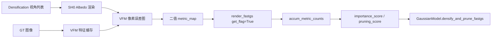

# 基于视觉基础模型的拓扑打分器管线

## 零、当前项目对齐结论

当前仓库是 FastGS 训练管线的直接实现，训练入口在 `src/vfm_gs/cli/train.py`，多视角拓扑打分集中在 `src/vfm_gs/utils/fast_utils.py`，光栅化器通过 `render_fastgs(..., get_flag=True, metric_map=...)` 返回 `accum_metric_counts`，最终由 `GaussianModel.densify_and_prune_fastgs()` 消费 `importance_score` 与 `pruning_score`。因此，VFM 接入的稳定 v1 不应绕开这条链路，而应把 VFM 输出收敛为和 FastGS 原有光度误差一致的 2D `metric_map`。

v1 的边界很明确：VFM 只做间歇式拓扑打分，不进入常规 RGB loss，不改优化器 step 时序，不直接创建或删除高斯点。它能增强 densification interval 上的候选评分，但仍受现有梯度门控、opacity 门控和尺寸门控约束。真正的强制增殖、任意高分修剪、VFM 单步反传都属于 v2 实验路径，需要改训练循环和 `GaussianModel` 的参数重建逻辑。



### 复盘 / 修正建议

- **当前判断**：这条结论与现有代码结构一致，比“VFM 直接掌控生杀”更容易落地。当前项目没有 VFM 后端、缓存系统或相关依赖，不能把 DINOv2、CLIP、Depth Anything 写成已存在能力。
- **修正建议**：文档后续所有设计都应围绕 `pixel_error_map -> metric_map -> accum_metric_counts -> score` 展开。涉及模型 API 的地方只写抽象接口，具体第三方库在实现前再查官方文档确认。
- **落地边界**：v1 只需要新增 VFM 缓存读取和打分函数，并替换或扩展 `compute_gaussian_score_fastgs()` 的评分来源；v2 才考虑修改训练入口的 `torch.no_grad()` densification 分支和优化器状态管理。

---

## 一、核心思想与管线重构动机

与每次迭代都向 3DGS 注入 VFM 梯度的持续监督策略相比，本方案把 VFM 放到 FastGS 已经存在的 densification/pruning 节点上使用。RGB loss 仍负责高频、低成本的常规优化；VFM 只在少量采样视角上检查结构一致性，并把结果转换成高斯级别的拓扑评分。

这个定位适合当前项目。FastGS 已经有多视角误差聚合机制，`accum_metric_counts` 可以统计每个 Gaussian 命中高误差像素的次数，`importance_score` 可以影响增殖候选，`pruning_score` 可以影响训练期预算裁剪和后期 `final_prune_fastgs()`。VFM 的价值不是替代这套机制，而是把“高误差像素”的来源从纯 RGB 误差扩展到语义或几何先验误差。

核心收益来自三点。VFM 推理只在 densification interval 触发，避免每步训练增加大模型开销。VFM 误差通过现有 CUDA 计数器映射回 Gaussian，减少额外 3D 归因逻辑。RGB 与 VFM 的职责分离，能让常规训练保持 FastGS 的速度，同时在拓扑更新点加入更稳的结构信号。

### 复盘 / 修正建议

- **当前判断**：“间歇式拓扑审查”的方向成立，但原文中“掌控生杀大权”“直接干预生长与消亡”的表述超过了当前代码能力。
- **修正建议**：将 VFM 描述为额外评分源。v1 中它只改变 `importance_score` 与 `pruning_score` 的数值分布，不直接绕过 `grad_thresh`、`grad_abs_thresh`、opacity 和尺度过滤。
- **落地边界**：v1 可在 `utils/fast_utils.py` 增加 VFM 评分分支；如果要让 VFM 独立触发 clone/split 或直接删除高分异常点，需要扩展 `GaussianModel.densify_and_prune_fastgs()` 的接口和决策逻辑。

---

## 二、管线详细执行步骤

### 步骤 1：离线预处理与缓存

训练前对 GT 图像生成 VFM 侧缓存，避免在每个 densification 节点重复处理 GT。缓存建议使用 `image_name` 作为持久键，因为它来自数据集文件名，跨训练运行更稳定；运行期可以再建立 `Camera.uid -> image_name -> cache_entry` 的映射。

缓存内容不应绑定某一个后端实现。抽象上只需要支持从 GT 图像得到对齐到训练分辨率的参考信号，例如语义特征图、相对深度图、边缘掩码或已经降维后的特征。缓存文件可以按场景保存到 `vfm_cache_dir`，并记录后端名称、输入分辨率、特征通道数和归一化方式。

### 步骤 2：主训练循环保持 FastGS 原路径

常规迭代仍沿用当前 `src/vfm_gs/cli/train.py` 的逻辑：随机取单视角，调用 `render_fastgs()`，计算 L1 与 fused SSIM，执行 `loss.backward()`，随后由 `gaussians.optimizer_step()` 或 sparse Adam 更新参数。VFM 不进入这条高频路径。

只有当 `iteration > opt.densify_from_iter` 且 `iteration % opt.densification_interval == 0` 时，训练才采样 `camlist` 并触发多视角评分。这个节点当前已经调用 `compute_gaussian_score_fastgs(camlist, gaussians, pipe, bg, opt, DENSIFY=True)`，VFM v1 的最小改动就是提供兼容该调用点的替代函数。

### 步骤 3：双轨制渲染与像素误差图

RGB 轨道保持当前 FastGS 行为，用真实 `active_sh_degree` 渲染，并基于 GT 图像得到光度误差图。VFM 轨道在同一视角下临时把 `gaussians.active_sh_degree` 设为 `0`，渲染近似 albedo 的基础颜色图，再送入 VFM 后端与 GT 缓存对齐比较。SH 阶数必须在 `try/finally` 中恢复，避免污染后续训练。

VFM 后端的输出统一为 `pixel_error_map`，形状与当前训练图像分辨率一致。不同后端可以用不同内部损失，但对 FastGS 侧只暴露一张连续误差图。该误差图经归一化和阈值化后得到 `metric_map`，再交给 `render_fastgs(..., get_flag=True, metric_map=metric_map)` 统计 Gaussian 命中次数。

### 步骤 4：拓扑裁决与分数融合

当前代码消费的是两个张量而不是显式 mask：`importance_score` 用于过滤 clone/split 候选，`pruning_score` 用于训练期预算裁剪和后期一致性修剪。VFM 分支应生成同样的两个张量，并与 RGB 分支融合。

建议的 v1 融合方式是保守的。`importance_score` 取 RGB 与 VFM 命中计数的逐点最大值，让任一信号认为某点处于高误差区域时都能提升其增殖机会。`pruning_score` 使用加权平均后重新归一化，例如 `normalize(w_rgb * rgb_pruning + w_vfm * vfm_pruning)`，避免 VFM 单独压倒现有光度一致性评分。

### 步骤 5：Hybrid Gradient Compensation 作为 v2 实验项

VFM 单步反传不属于当前 v1。现有 densification 分支在 `with torch.no_grad()` 中执行，而且 clone、split、prune 会通过 `nn.Parameter` 重建张量并改写 optimizer state。若在这里直接对 VFM loss 调用 `.backward()`，梯度归属、参数生命周期和优化器状态都不可靠。

v2 若要探索梯度补偿，需要重新设计执行顺序：VFM loss 的前向和反传必须发生在可跟踪 autograd 的上下文中；densification 前后的参数必须有明确的梯度继承策略；optimizer state 对新增点、删除点和原点的处理需要显式定义。否则该能力只能停留在概念层面。

### 复盘 / 修正建议

- **当前判断**：离线缓存、主循环低频触发、SH0 albedo 渲染都可以作为设计方向；原文把 VFM loss 直接变成 Gaussian 分数和梯度补偿，缺少与当前接口的中间层。
- **修正建议**：把在线接口收敛成 `pixel_error_map`，再通过 `metric_map` 和 `accum_metric_counts` 映射到 Gaussian。`active_sh_degree=0` 必须局部生效并可靠恢复。
- **落地边界**：v1 可以实现双轨评分和分数融合；“强制增殖”“激进修剪”“VFM 反传补偿”需要额外改动 `GaussianModel` 和训练循环，不应混在 v1 交付中。

---

## 三、核心损失接口与候选后端

FastGS 侧不直接依赖某个 VFM 损失公式，而依赖统一接口：

$$
\text{pixel\_error\_map} = \Phi_{\text{vfm}}(I_{\text{albedo}}, \text{Cache}_{GT})
$$

这里的 $\Phi_{\text{vfm}}$ 可以由不同后端实现，但输出必须是 $H \times W$ 的非负误差图，并与当前训练图像分辨率对齐。为了降低误差尺度差异，进入阈值化前需要做稳健归一化，例如按有效像素的分位数或中位数缩放，而不是直接依赖某个后端的原始 loss 数值。

### 语义特征误差

当使用 DINOv2、CLIP 或类似语义特征模型时，可以对渲染图和 GT 缓存特征计算像素级余弦距离：

$$
\mathcal{E}_{sem}(x,y) = 1 - \frac{\hat{\mathcal{F}}_{rend}(x,y) \cdot \hat{\mathcal{F}}_{GT}(x,y)}{\|\hat{\mathcal{F}}_{rend}(x,y)\|_2 \|\hat{\mathcal{F}}_{GT}(x,y)\|_2 + \epsilon}
$$

该误差更适合发现语义结构错位，但对纹理重复、透明材质和强视角相关外观可能不稳定。因此它应作为 topology score 的补充信号，而不是单独替代 RGB score。

### 几何先验误差

当使用 Depth Anything 或其他 monocular depth 后端时，GT 与渲染图得到的是相对深度或视差先验。由于尺度和偏移通常不可靠，比较时应优先使用局部相关性、梯度方向或边缘一致性：

$$
\mathcal{E}_{geo}^{patch} = 1 - \frac{\text{cov}(\mathcal{D}_{rend}^{(p)}, \mathcal{D}_{GT}^{(p)})}{\sigma_{\mathcal{D}_{rend}^{(p)}} \sigma_{\mathcal{D}_{GT}^{(p)}} + \epsilon}
$$

$$
\mathcal{E}_{edge}(x,y) = M_{edge}(x,y)\left\|\nabla \mathcal{D}_{rend}(x,y) - \nabla \mathcal{D}_{GT}(x,y)\right\|_1
$$

几何误差最后仍要合成为 `pixel_error_map`。如果当前 renderer 不返回深度图，v1 不应假设可直接得到 $\mathcal{D}_{rend}$；可以先用 albedo 图经过同一 depth 后端预测相对深度，后续再考虑改 CUDA renderer 输出真实渲染深度。

### 复盘 / 修正建议

- **当前判断**：语义和几何公式可以保留为候选，但当前项目没有任何 VFM 依赖，也没有 renderer depth 输出接口。
- **修正建议**：文档主接口写成后端无关的 `pixel_error_map`。Depth Anything、DINOv2、CLIP 的具体 API、依赖版本和显存开销必须在实现阶段查官方文档或实际 benchmark 后确定。
- **落地边界**：v1 只要求 VFM 后端能从 `I_albedo` 与 GT 缓存生成像素误差图；真实深度渲染监督、跨尺度特征金字塔和可微 VFM loss 都是后续扩展。

---

## 四、拓扑打分器分数计算

在得到 `pixel_error_map` 后，VFM 分数需要沿用 FastGS 的计数器机制，而不是直接把 2D loss 当成 Gaussian loss。处理流程如下：

1. 将 `pixel_error_map` 归一化为 $[0, 1]$ 区间。
2. 用阈值 $\tau_{vfm}$ 生成二值掩码：

   $$
   M_{vfm}(x,y) =
   \begin{cases}
   1, & \text{if } \text{pixel\_error\_map}(x,y) > \tau_{vfm} \\
   0, & \text{otherwise}
   \end{cases}
   $$

3. 将 $M_{vfm}$ flatten 成当前 rasterizer 期望的一维 `metric_map`。
4. 调用 `render_fastgs(..., get_flag=True, metric_map=metric_map)`。
5. 读取返回的 `accum_metric_counts`，作为当前视角下每个 Gaussian 的高误差命中次数。

CUDA 计数器的语义需要准确理解。它不是几何意义上的“投影落点个数”，而是在前向 alpha compositing 中，当某个 Gaussian 对某个高误差像素有有效贡献时执行 `atomicAdd`。这意味着它天然考虑了可见性、透明度阈值和前后遮挡顺序，比单纯的投影覆盖更接近当前渲染误差来源。

多视角聚合时，importance 侧保持计数语义：

$$
S_{vfm}^{count}(i) = \left\lfloor \frac{1}{K}\sum_{v=1}^{K} C_i^{(v)} \right\rfloor
$$

pruning 侧可以参考当前 `compute_gaussian_score_fastgs()` 的做法，将每个视角的全局 VFM loss 与命中计数相乘后累加，再归一化为 $[0,1]$：

$$
S_{vfm}^{prune}(i) =
\text{normalize}\left(\sum_{v=1}^{K} \bar{\mathcal{E}}_{vfm}^{(v)} C_i^{(v)}\right)
$$

### 复盘 / 修正建议

- **当前判断**：这一节与当前项目最贴近，`metric_map` 和 `accum_metric_counts` 是 VFM v1 最应复用的接口。
- **修正建议**：补充计数器真实语义，避免把它误解成任意 2D 到 3D 的可微反投影。分数输出应保持 `importance_score, pruning_score`，这样才能直接接入现有 `densify_and_prune_fastgs()`。
- **落地边界**：v1 不需要改 CUDA 计数器；如果后续要统计权重化误差而不只是二值命中，需要扩展 rasterizer 的 `metric_map` 类型和累加逻辑。

---

## 五、工程化实现伪代码

下面伪代码只描述 v1 可落地路径。它保持现有 FastGS 函数的返回形状，供训练入口的 densification 分支直接消费。

```python
def normalize01(value):
    value = value.detach()
    value = torch.nan_to_num(value, nan=0.0, posinf=0.0, neginf=0.0)
    denom = torch.clamp(value.max() - value.min(), min=1e-6)
    return (value - value.min()) / denom


def render_with_sh0(view, gaussians, pipe, bg, mult):
    current_sh_degree = gaussians.active_sh_degree
    try:
        gaussians.active_sh_degree = 0
        return render_fastgs(view, gaussians, pipe, bg, mult)["render"]
    finally:
        gaussians.active_sh_degree = current_sh_degree


def compute_gaussian_score_fastgs_with_vfm(
    camlist,
    gaussians,
    pipe,
    bg,
    args,
    vfm_backend,
    vfm_cache,
    DENSIFY=False,
):
    rgb_importance, rgb_pruning = compute_gaussian_score_fastgs(
        camlist, gaussians, pipe, bg, args, DENSIFY=DENSIFY
    )

    vfm_counts_total = None
    vfm_pruning_total = None

    for view in camlist:
        albedo_image = render_with_sh0(view, gaussians, pipe, bg, args.mult)

        cache_key = view.image_name
        gt_features = vfm_cache[cache_key]
        pixel_error_map = vfm_backend.compute_pixel_error_map(
            rendered_image=albedo_image,
            gt_cache=gt_features,
        )

        metric_map_2d = (normalize01(pixel_error_map) > args.vfm_loss_thresh).int()
        metric_map = metric_map_2d.reshape(-1).contiguous()

        render_pkg = render_fastgs(
            view,
            gaussians,
            pipe,
            bg,
            args.mult,
            get_flag=True,
            metric_map=metric_map,
        )
        counts = render_pkg["accum_metric_counts"]

        if DENSIFY:
            vfm_counts_total = counts.clone() if vfm_counts_total is None else vfm_counts_total + counts

        view_error = pixel_error_map.detach().mean()
        weighted_counts = view_error * counts.float()
        vfm_pruning_total = (
            weighted_counts.clone()
            if vfm_pruning_total is None
            else vfm_pruning_total + weighted_counts
        )

    vfm_pruning = normalize01(vfm_pruning_total)

    if DENSIFY:
        vfm_importance = torch.div(vfm_counts_total, len(camlist), rounding_mode="floor")
        importance_score = torch.maximum(rgb_importance, vfm_importance)
    else:
        importance_score = None

    rgb_weight = 1.0
    vfm_weight = args.vfm_weight
    pruning_score = normalize01(rgb_weight * rgb_pruning + vfm_weight * vfm_pruning)

    return importance_score, pruning_score
```

建议配置项保持最小集合：

- `vfm_enable`：是否启用 VFM 拓扑打分。
- `vfm_backend`：后端名称，例如 `dinov2`、`clip`、`depth_anything`。
- `vfm_cache_dir`：GT 侧缓存目录。
- `vfm_loss_thresh`：VFM 像素误差图二值化阈值。
- `vfm_weight`：VFM pruning score 融合权重。
- `vfm_use_albedo_sh0`：是否使用 SH0 渲染图作为 VFM 输入。

### 复盘 / 修正建议

- **当前判断**：原伪代码返回 `densify_mask, prune_mask`，与当前 FastGS 接口不一致；直接调用 `vfm_loss_total.backward()` 也不符合当前 densification 执行环境。
- **修正建议**：伪代码应返回 `importance_score, pruning_score`。VFM 分支只产生 `metric_map` 和计数，不保留计算图，不对现有训练 loss 做反传。
- **落地边界**：这段伪代码仍是设计参考。真正编码时需要处理空计数、`rgb_pruning` 归一化分母为零、缓存缺失、CPU/GPU 数据位置和不同 VFM 后端输出分辨率等工程细节。

---

## 六、后续实现与验证建议

实现顺序应先保证无 VFM 时行为完全不变，再接入缓存和后端。最小改动路径是在 `src/vfm_gs/utils/fast_utils.py` 新增一个 VFM 版 scoring 函数，在 `src/vfm_gs/config/legacy_args.py` 暴露少量配置，在训练入口的 densification 调用点按 `vfm_enable` 选择原函数或 VFM 函数。

验证也应分层推进。先用 mock VFM 后端返回 RGB L1 error map，确认输出张量形状、device 和原 FastGS 兼容。再接入真实 VFM 缓存，检查单场景短迭代不会破坏训练。最后才比较启用 VFM 前后的 Gaussian 数量、训练时间、PSNR/SSIM/LPIPS 和浮点伪影变化。

### 复盘 / 修正建议

- **当前判断**：文档本身不应承诺质量收益，只有实现和实验能证明 VFM score 是否改善拓扑。
- **修正建议**：把验收标准写成可观测指标：训练是否稳定、评分张量是否对齐、耗时增加是否可接受、后期 pruning 是否减少明显 floaters。
- **落地边界**：本轮只更新方案文档；进入代码实现前，需要先确定 VFM 后端和缓存格式，并为 Python 3.7 / PyTorch 1.12.1 / CUDA 11.6 环境确认依赖兼容性。
